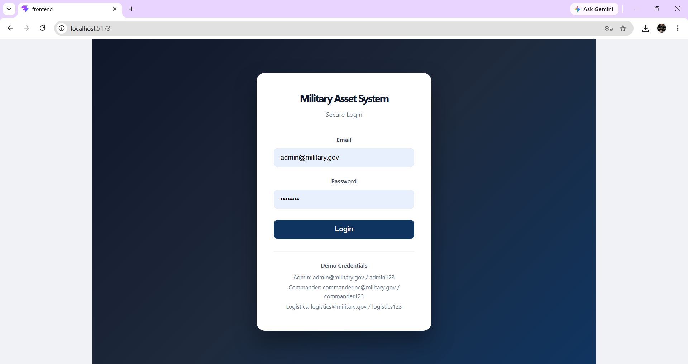
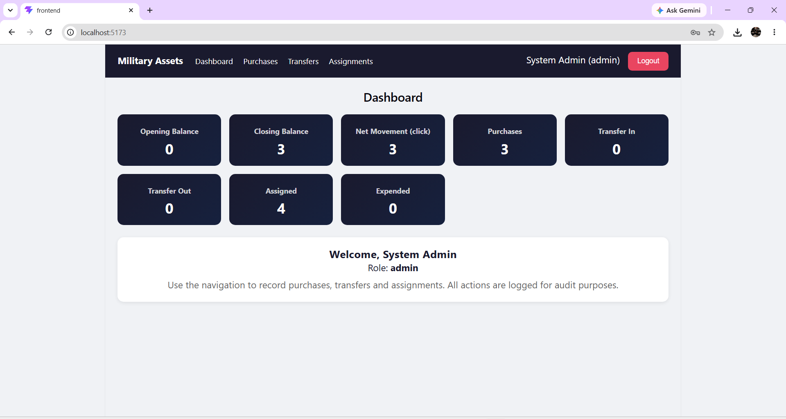
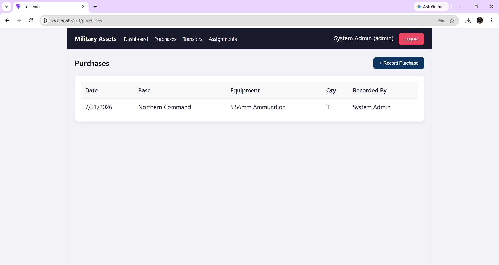
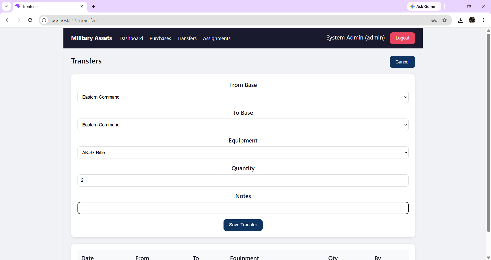
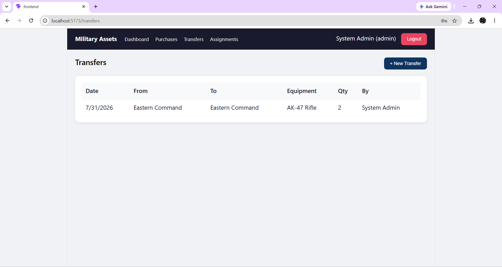
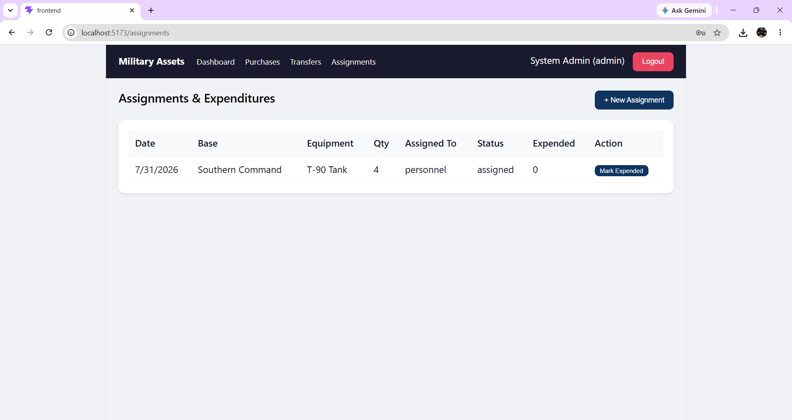

# Military Asset Management System

A full-stack web application for tracking movement, assignment and expenditure of critical military assets (vehicles, weapons, ammunition) across multiple bases.

Built as a take-home assignment for **kristallball – Full Stack Engineer**.

---

## Features Implemented

### Dashboard
- Opening Balance, Closing Balance, Net Movement
- Purchases, Transfer In, Transfer Out, Assigned, Expended metrics
- Click on Net Movement to see detailed breakdown (bonus)

### Purchases
- Record new purchases for any base
- View history with base / equipment filters

### Transfers
- Transfer assets between bases
- Full history with timestamps

### Assignments & Expenditures
- Assign assets to personnel
- Mark quantities as expended

### Role-Based Access Control (RBAC)
| Role               | Access                                      |
|--------------------|---------------------------------------------|
| Admin              | Full access to everything                   |
| Base Commander     | Only their assigned base data & operations  |
| Logistics Officer  | Purchases and Transfers only                |

### Security & Logging
- JWT Authentication
- Role middleware on every protected route
- Every create / expend action is logged in the `logs` collection for audit

---

## Tech Stack & Why I Chose It

| Layer     | Technology              | Reason |
|-----------|-------------------------|--------|
| Frontend  | React + Vite + React Router | Fast, component-based, matches my previous projects (Nxt Trendz, Nxt Watch) |
| Backend   | Node.js + Express       | Lightweight, fast for REST APIs, familiar from my full-stack projects |
| Auth      | JWT + bcryptjs          | Stateless, secure, easy to implement with roles |
| Database  | MongoDB (Mongoose)      | Flexible documents for transaction history + easy population of related data. Good for rapid development while still supporting all required tracking. |
| Styling   | Custom CSS              | Clean, responsive, no extra dependency |

I chose **MongoDB** because:
- Easy to store nested history and logs
- Fast development with Mongoose population
- Free Atlas tier is perfect for demos
- Still supports all required queries for balances and movements

---

## Project Structure

```
military-asset-management/
├── backend/
│   ├── src/
│   │   ├── config/db.js
│   │   ├── models/          (User, Base, Equipment, Purchase, Transfer, Assignment, Log)
│   │   ├── middleware/      (auth.js, logger.js)
│   │   ├── routes/          (auth, bases, equipment, purchases, transfers, assignments, dashboard, logs)
│   │   ├── utils/generateToken.js
│   │   ├── seed.js
│   │   └── server.js
│   ├── .env.example
│   ├── .gitignore
│   └── package.json
├── frontend/
│   ├── src/
│   │   ├── components/Navbar.jsx
│   │   ├── pages/           (Login, Dashboard, Purchases, Transfers, Assignments)
│   │   ├── services/api.js
│   │   ├── App.jsx
│   │   └── App.css
│   └── package.json
├── .gitignore
└── README.md
```

---

## Setup Instructions (Local)

### 1. Prerequisites
- Node.js 18+
- MongoDB (local **or** Atlas)

### 2. Backend

```bash
cd backend
npm install
cp .env.example .env
```

Edit `.env`:

```
PORT=5000
MONGODB_URI=mongodb://127.0.0.1:27017/military_assets
JWT_SECRET=my_super_secret_jwt_key_change_this_in_production_12345
JWT_EXPIRE=7d
NODE_ENV=development
```

**For MongoDB Atlas (recommended for reviewers):**
1. Go to https://cloud.mongodb.com
2. Create free cluster
3. Database Access → Create user
4. Network Access → Add IP Address → `0.0.0.0/0` (allow from anywhere)
5. Copy connection string and put it in `MONGODB_URI`

Then seed data:

```bash
node src/seed.js
```

Start server:

```bash
npm run dev
```

### 3. Frontend

```bash
cd frontend
npm install
```

Create `.env` (optional):

```
VITE_API_URL=http://localhost:5000/api
```

Start:

```bash
npm run dev
```

Open http://localhost:5173

---

## Login Credentials (after running seed)

| Role               | Email                        | Password       |
|--------------------|------------------------------|----------------|
| Admin              | admin@military.gov           | admin123       |
| Base Commander     | commander.nc@military.gov    | commander123   |
| Logistics Officer  | logistics@military.gov       | logistics123   |

---

## API Endpoints (main ones)

### Auth
- `POST /api/auth/login`
- `POST /api/auth/register`
- `GET  /api/auth/me`

### Bases & Equipment
- `GET  /api/bases`
- `POST /api/bases` (admin)
- `GET  /api/equipment`
- `POST /api/equipment` (admin)

### Purchases
- `GET  /api/purchases`
- `POST /api/purchases`

### Transfers
- `GET  /api/transfers`
- `POST /api/transfers`

### Assignments
- `GET  /api/assignments`
- `POST /api/assignments`
- `PUT  /api/assignments/:id/expend`

### Dashboard
- `GET  /api/dashboard/metrics`

### Logs (admin only)
- `GET  /api/logs`

All protected routes require header:  
`Authorization: Bearer <token>`

---

## Database Decision & How it Supports Requirements

I used **MongoDB** with the following collections:

- **users** – role + assignedBase for RBAC
- **bases** – multiple bases
- **equipment** – vehicles / weapons / ammunition
- **purchases** – records of new assets
- **transfers** – movement history between bases
- **assignments** – who has the asset + expended quantity
- **logs** – full audit trail

Net Movement is calculated as:  
`Purchases + Transfers In – Transfers Out`

This structure directly supports Opening/Closing balances, clear history, and role-based filtering.

---

## Assumptions & Limitations

- Opening Balance is simplified (calculated from net movement for demo purposes)
- No real-time stock validation (e.g. cannot transfer more than available) – can be added later
- Frontend filters on Dashboard are basic (can be extended)
- Designed for demonstration of architecture, RBAC and core flows

---

## Screenshots

### Login Page


### Dashboard


### Purchases


### Transfers Form


### Transfers List


### Assignments


---


## Author

**Somarouthu Rajyalakshmi**  
Full Stack Developer  
Guntur, Andhra Pradesh  

This project was built end-to-end by me using React, Node.js, Express and MongoDB.
